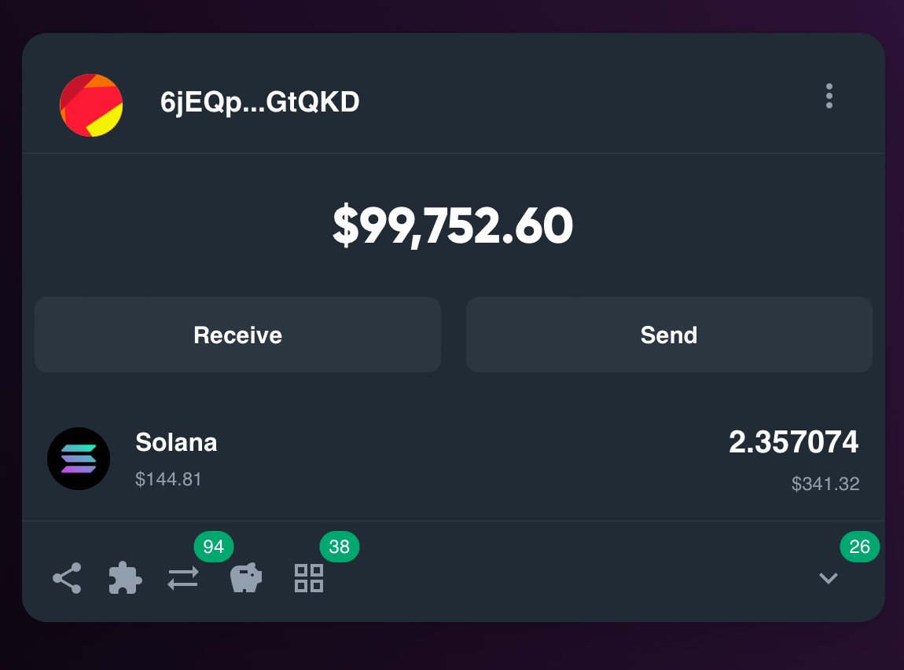
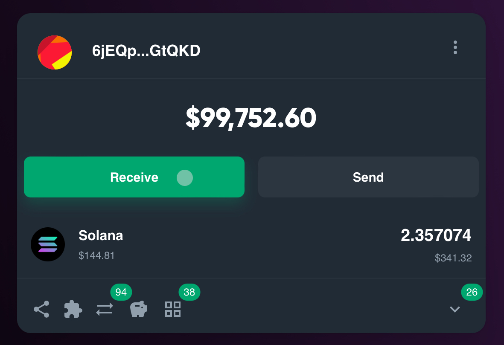
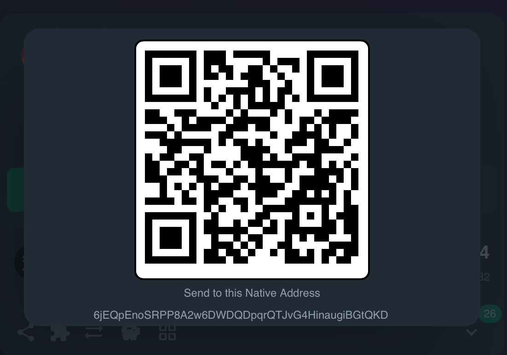
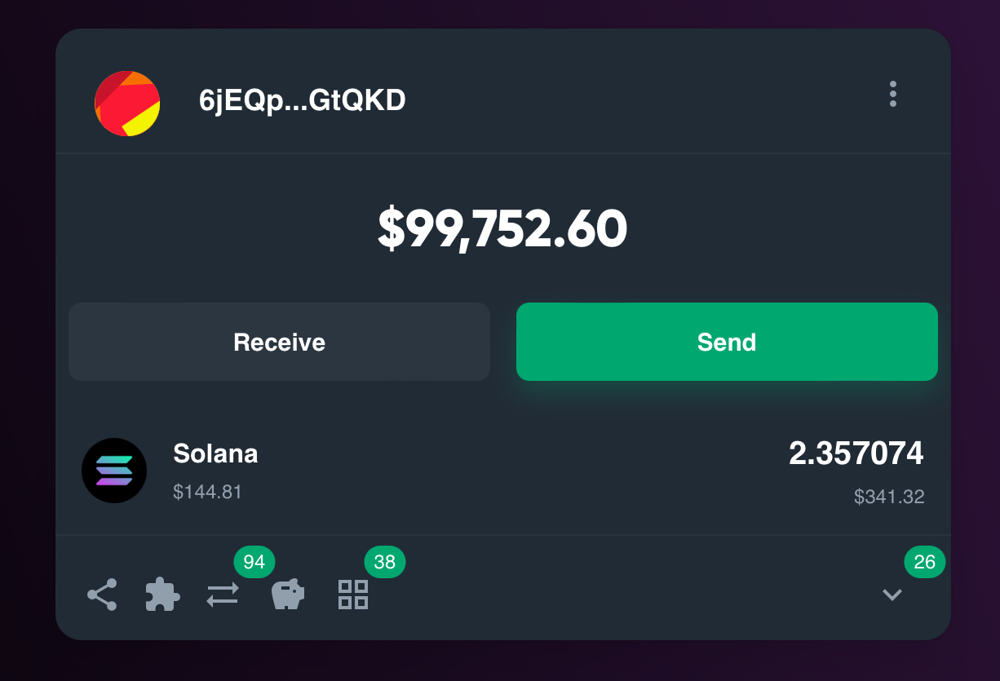
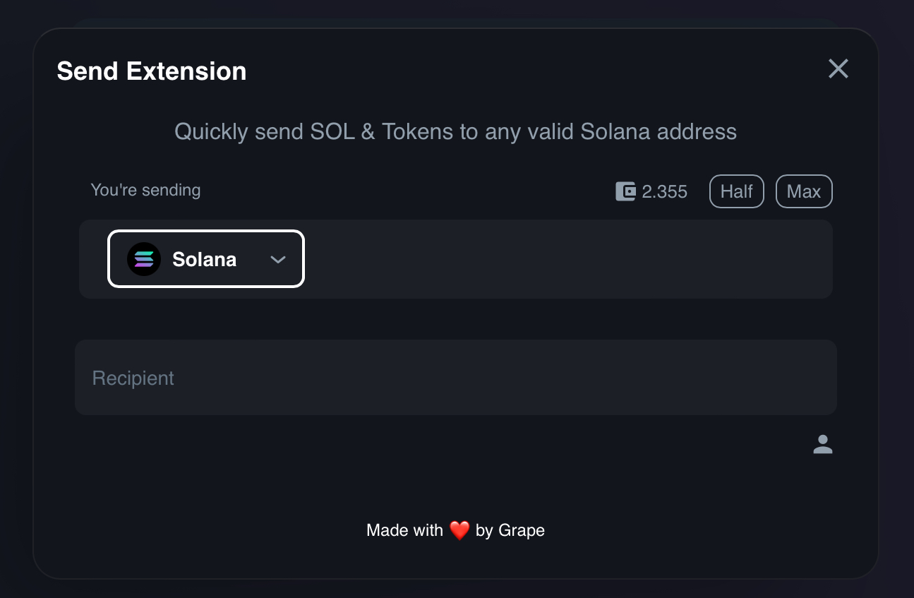

# DAO Wallet

The DAO Wallet is a new way of interpreting each respective treasury wallet a DAO has, given that navigation and viewing the holding tends to be a tedious task, Grape has made exploring those wallets easy and as native looking as possible.

<figure><figcaption></figcaption></figure>

## Finding the wallet address

<figure><figcaption></figcaption></figure>

 

<figure><figcaption></figcaption></figure>

## Sending SOL

<figure><figcaption></figcaption></figure>

 

<figure><figcaption></figcaption></figure>

 

<figure><figcaption></figcaption></figure>

## Sending Tokens

<figure><figcaption></figcaption></figure>

<figure><figcaption></figcaption></figure>

<figure><figcaption></figcaption></figure>

## Sending NFTs

This feature is coming soon
