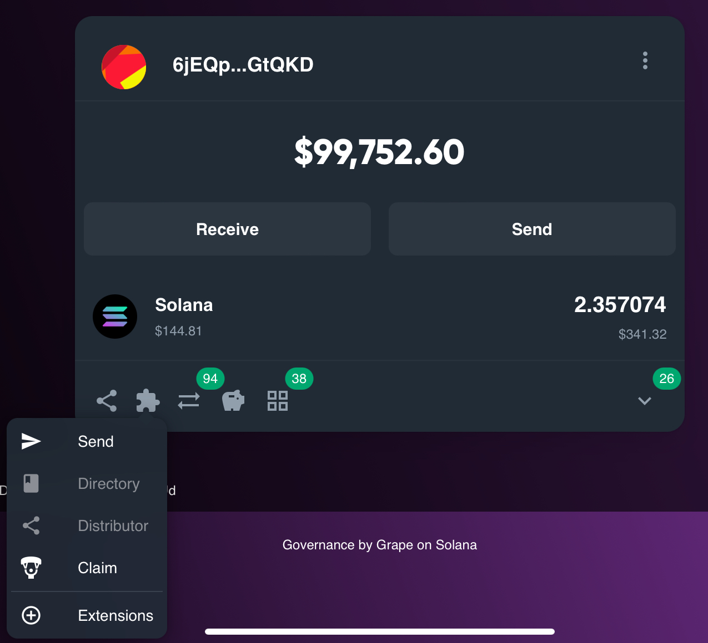

# Extensions

The Treasury Wallet Extensions system powers all DAO wallet interactions on Governance.so. Whether you’re initiating a simple token transfer or creating a complex proposal, every action is handled through modular, extensible plugins.

## 🧩 Available Extensions

\
Governance.so currently supports the following extensions:

* Send – Transfer SOL or SPL tokens directly from the DAO treasury
* Token Management – Manage token accounts, mint authorities, and metadata
* Directory – Maintain and organize DAO-related addresses
* Staking to a Validator – Delegate SOL to a validator directly from the DAO
* Custom IX (Instruction) – Submit raw Solana instructions for maximum flexibility
* Distributor – Set up and manage distributions from the treasury
* Claim – Allow DAO members to claim tokens or rewards through predefined logic

Each extension integrates seamlessly with the DAO’s wallet and governance flow, allowing participants to interact with treasury assets safely and efficiently.

## 🔧 Building with Extensions

All wallet actions on Governance.so are built on this extensions plugin architecture, making it easy for developers to expand functionality or tailor tools to specific DAO needs.

To explore or contribute your own plugin:

1. Click the Extensions button within a DAO’s Treasury panel
2. Connect with the Grape DAO to access developer resources
3. Learn how to build and integrate custom plugins into your DAO’s workflow

<figure><figcaption></figcaption></figure>
